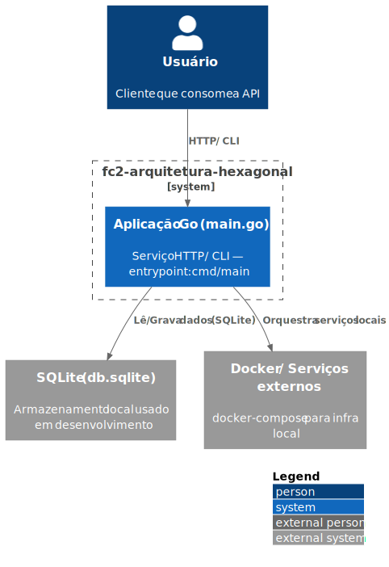
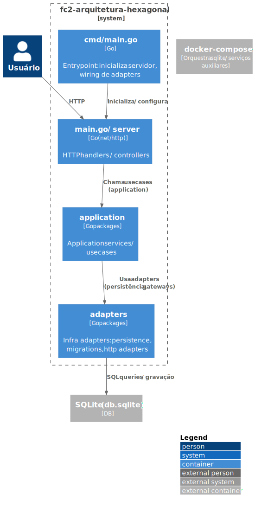
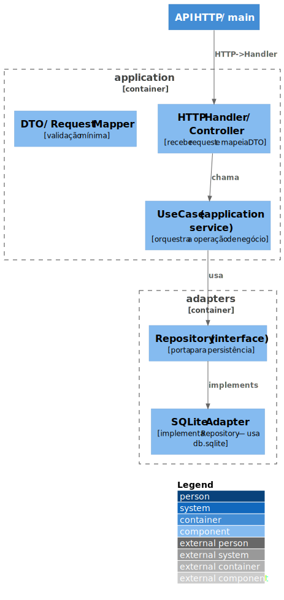
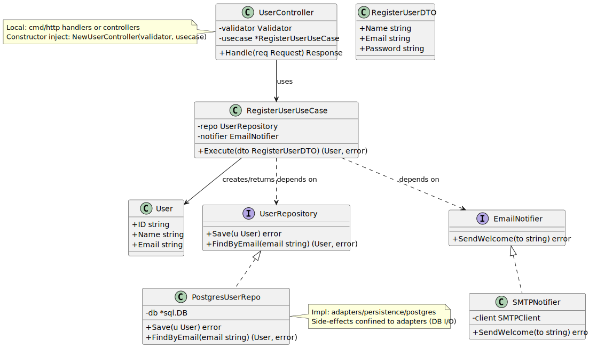

[](https://github.com/danielso2007/fc2-arquitetura-hexagonal/actions/workflows/node.js.yml)

[](https://github.com/danielso2007/fc2-arquitetura-hexagonal/pulls)
[](https://github.com/danielso2007/fc2-arquitetura-hexagonal/issues?q=is%3Aopen+is%3Aissue)


[](https://conventionalcommits.org)

# Projeto de curso Arquitetura Hexagonal

Para estudo.

### Iniciando o projeto

# Estrutura do projeto

Obs.: Para gerar essa saída, foi usado o comando: `tree -I "node_modules|dist|.git"`

```shell
.
├── adapters
│   ├── cli
│   │   ├── product.go
│   │   └── product_test.go
│   ├── db
│   │   ├── product.go
│   │   └── product_test.go
│   ├── dto
│   │   └── product.go
│   └── web
│       ├── handler
│       │   ├── error_json.go
│       │   ├── error_json_test.go
│       │   └── product.go
│       └── server
│           └── server.go
├── application
│   ├── mocks
│   │   └── application.go
│   ├── product.go
│   ├── product_service.go
│   ├── product_service_test.go
│   └── product_test.go
├── cmd
│   ├── cli.go
│   ├── http.go
│   └── root.go
├── db.sqlite
├── docker-compose.yaml
├── Dockerfile
├── go.mod
├── go.sum
├── LICENSE
├── main.go
├── package.json
└── README.md
```

# Diagrama de arquitetura

### Nível 1



### Nível 2



### Nível 3



### Nível 4



## Pontos técnicos e mapeamento:

- `interface UserRepository` = port (coloque em `application/ports` ou `domain/ports`).
- `PostgresUserRepo` = adapter/infra (`adapters/postgres`) — contém `*sql.DB` e queries.
- `RegisterUserUseCase` = application service (`application/user/usecase.go`) — injeta `UserRepository` e `EmailNotifier`.
- `UserController` = adapter de entrada (`cmd/http/handler.go`) — converte request → DTO → chama usecase.
- Testes: mock `UserRepository` e `EmailNotifier` ao testar `RegisterUserUseCase`.

